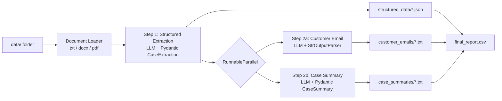

# AI-Powered Document Processing & Business Workflow

**AI Customer Complaint & Case Processing System**, a GenAI batch workflow that reads customer complaint documents, extracts structured case data, writes a customer response email and an internal management summary for each case, and builds a consolidated report.

## Features

- **Document ingestion:** batch reads `.txt`, `.docx` and `.pdf` files from `data/`. Unsupported, unreadable or empty files are logged and skipped without stopping the batch.
- **Structured extraction:** LLM output is validated against a Pydantic schema (`CaseExtraction`).
- **Customer email generation:** a professional, grounded reply that doesn't invent refunds, dates or promises.
- **Internal case summary:** a structured `CaseSummary` covering overview, key issue, action taken, status and next action.
- **Workflow orchestration:**
  - For each document, extraction runs first. The email and summary are then generated in parallel with LangChain `RunnableParallel`.
  - Several documents are processed at once with a thread pool.
- **Resilience:** automatic retries on LLM calls and per-file error isolation.
- **Logging:** logs go to the console and to `output/processing.log`.
- **Provider-agnostic:** switch between OpenAI and Gemini in `config.json`.

## Architecture



A detailed description is in [Architecture.docx](Architecture.docx).

## Project Structure

```
Capstone_Project/
├── main.py                 # Entry point: batch orchestration, outputs, CSV report, logging
├── workflow.py             # CaseWorkflow: extraction -> (email || summary)
├── document_loader.py      # File discovery and text extraction (txt/docx/pdf)
├── schemas.py              # Pydantic models: CaseExtraction, CaseSummary
├── prompts.py              # Prompt templates for the three AI tasks
├── llm_factory.py          # LLM creation (OpenAI / Gemini) from config
├── create_sample_docs.py   # Splits data.txt into sample files in data/
├── config.json             # Provider, model, paths, concurrency
├── data.txt                # Source of dummy complaint data
├── requirements.txt
├── .env.example
├── data/                   # Input documents
└── output/                 # Generated results
```

## Setup

1. Create or activate a virtual environment and install the dependencies:
   ```powershell
   pip install -r requirements.txt
   ```
2. Copy `.env.example` to `.env` and add your API key(s):
   ```
   OPENAI_API_KEY=...
   GEMINI_API_KEY=...
   ```
3. Optionally, set the provider and model in `config.json`:
   ```json
   { "provider": "openai", "max_workers": 3 }
   ```
   The Gemini free tier allows only about 5 requests per minute. If you use it, set `max_workers` to `1`.

## Usage

```powershell
python create_sample_docs.py   # generate sample complaints in data/ (optional)
python main.py                 # process all documents
```

## Output

```
output/
├── structured_data/      # <name>.json: validated CaseExtraction
├── customer_emails/      # <name>_email.txt
├── case_summaries/       # <name>_summary.txt
├── final_report.csv      # one row per document, including failures
└── processing.log
```

### Extracted fields (`CaseExtraction`)

| Field | Type |
|---|---|
| customer_name | str |
| email, phone_number, product_or_service | Optional[str] |
| complaint_category | Billing / Product Defect / Delivery / Service Quality / Technical Issue / Refund / Account / Other |
| issue_description | str |
| resolution_provided | Optional[str] |
| is_complaint, escalation_required, supporting_document_available | Yes / No |
| case_status | Open / In Progress / Resolved / Escalated / Closed |

### Sample result

| File | Customer | Category | Complaint | Escalation | Status |
|---|---|---|---|---|---|
| complaint_001.txt | Priya Sharma | Technical Issue | Yes | No | Resolved |
| complaint_002.txt | Michael Turner | Billing | Yes | Yes | Escalated |
| complaint_003.txt | Aisha Khan | Delivery | Yes | No | In Progress |
| complaint_004.docx | Daniel Okafor | Product Defect | Yes | Yes | Escalated |
| complaint_005.txt | Elena Rossi | Other | No | No | Closed |

## Skills Demonstrated

Python, LLM API integration (LangChain, OpenAI, Gemini), prompt engineering, structured outputs with Pydantic, batch processing, sequential and parallel workflow orchestration, error handling, modular code, file processing and logging.
